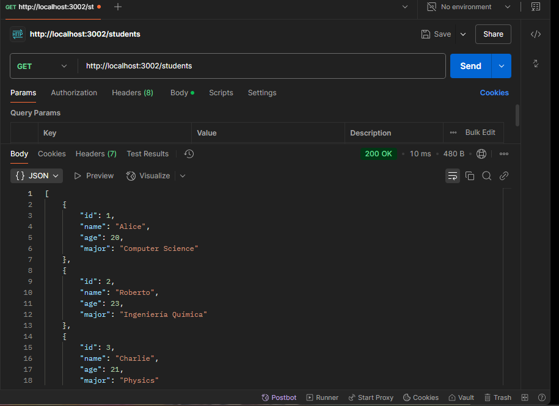
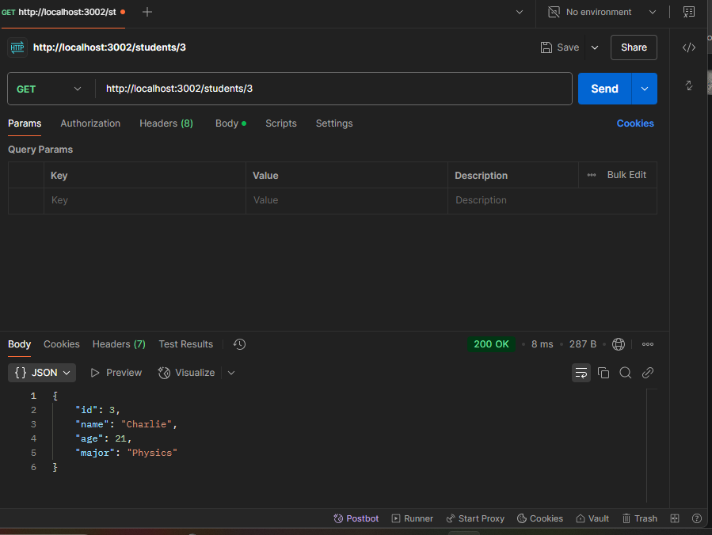
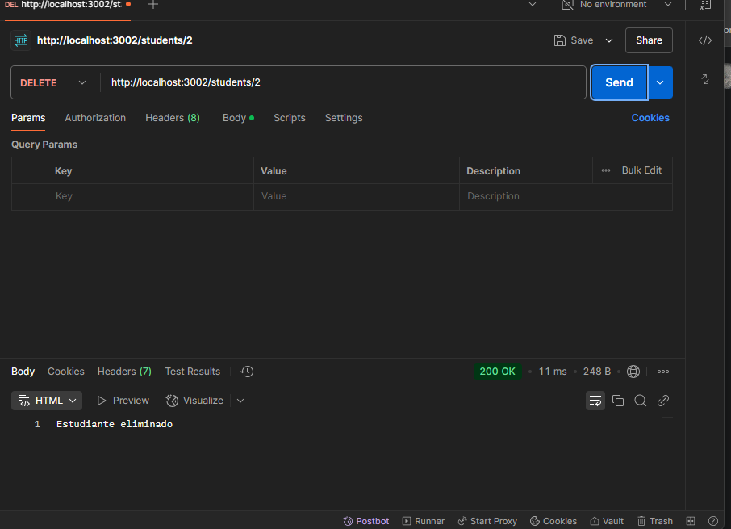

# API de Estudiantes

Esta es una API básica para gestionar una lista de estudiantes.

## Endpoints

* **GET /students:** Retorna la lista de todos los estudiantes.
* **GET /students/:id:** Retorna los detalles de un estudiante específico.
* **DELETE /students/:id:** Elimina un estudiante específico.

## Uso

1.  Clona el repositorio.
2.  Ejecuta `npm install` para instalar las dependencias.
3.  Ejecuta `node index.js` para iniciar el servidor.
4.  Utiliza Postman o cualquier otro cliente HTTP para probar los endpoints.

## Capturas de pantalla de Postman

()
()
()

