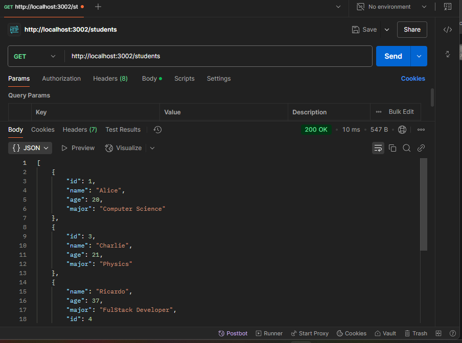
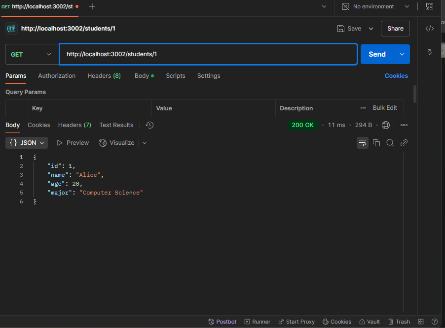
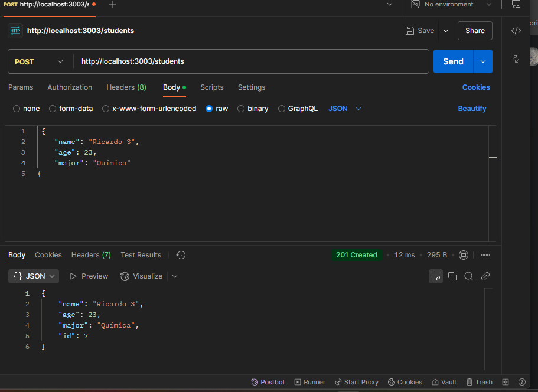
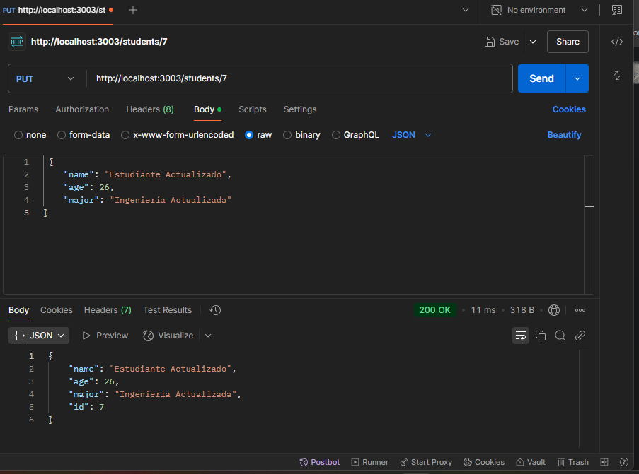
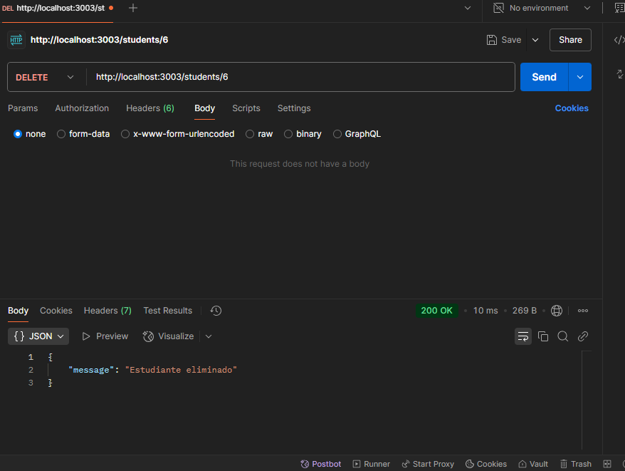

# API de Estudiantes

Esta API gestiona una lista de estudiantes con funcionalidades CRUD.

## Endpoints

* **GET /students:** Obtiene la lista de todos los estudiantes.
* **GET /students/:id:** Obtiene un estudiante por su ID.
* **POST /students:** Crea un nuevo estudiante.
* **PUT /students/:id:** Actualiza un estudiante existente.
* **DELETE /students/:id:** Elimina un estudiante por su ID.

## Uso

1.  Clona el repositorio.
2.  Ejecuta `npm install` para instalar las dependencias.
3.  Ejecuta `node index.js` para iniciar el servidor.
4.  Utiliza Postman para probar los endpoints.

## Validaciones

* **POST /students:**
    * El nombre no puede estar vacío.
    * La edad debe ser un número positivo.
    * La carrera es requerida.
* **PUT /students/:id:**
    * El nombre no puede estar vacío.
    * La edad debe ser un número positivo.

## Capturas de pantalla de Postman

()
()
()
()
()